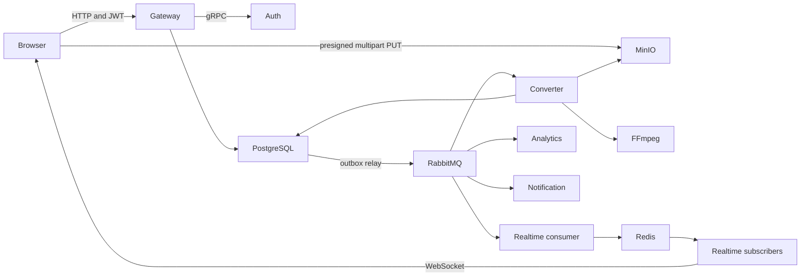

# Following a video through Prism

A media converter looks simple until the upload outlives an HTTP request.

The browser has to move a large file somewhere. A worker has to claim it, run FFmpeg, store the result, and report progress. If the API crashes after updating PostgreSQL but before publishing a RabbitMQ message, the job cannot disappear into a permanent `PENDING` state. If two workers see the same event, they cannot both send notifications and overwrite the same output. If a user has two Realtime pods behind a load balancer, either pod must be able to reach the user's socket.

Prism is a monorepo that tries to solve this whole path. Most of its backend is Go. Analytics is Python. The dashboard is Next.js. PostgreSQL owns durable state, MinIO owns media files, RabbitMQ carries events, and Redis handles token checks, rate limits, and cross-pod WebSocket fan-out.

That is a lot of machinery for converting a video to MP3. It is also the point of the project. The interesting code is less about FFmpeg than about what happens on either side of it.

## The system at a glance

Prism contains seven application services.

| Component | Job |
| --- | --- |
| Frontend | Starts uploads, displays history, and receives live updates |
| Gateway | Exposes the HTTP API and signs direct MinIO uploads |
| Auth | Issues JWTs and refresh tokens over gRPC |
| Converter | Runs FFmpeg jobs from RabbitMQ |
| Realtime | Moves job events to browser WebSockets |
| Analytics | Runs Whisper transcription or OpenCV thumbnail extraction |
| Notification | Sends terminal job results through Discord and SMTP |

The boundaries are real, not folders wrapped around one process. Each Go service has its own module and container. The Python worker has its own `uv` project. Protobuf contracts in `api/proto` connect the services, while `infra/postgres/schema.sql` defines the shared database.



The diagram is tidy. The code underneath is more revealing.

## The browser does not send video through the API

The upload starts in `frontend/src/components/dashboard/upload-zone.tsx`. A user picks one of four operations: extract MP3, convert to HLS, convert to MKV, or generate a GIF. GIF jobs open a clip selector that records a start time and duration.

The frontend divides each file into 5 MiB pieces. It asks the Gateway to initialize a multipart upload, then runs up to three part uploads at once. Those PUT requests go straight to MinIO through signed URLs. The Gateway sees metadata and ETags, not gigabytes of video.

This is the right split. Relaying every byte through Gin would consume API connections, memory, and network bandwidth for work that object storage already knows how to do. It would also make upload throughput depend on Gateway replica count.

The frontend calculates progress from bytes sent across all active parts. When every PUT finishes, it sorts the collected ETags and calls the multipart finalization endpoint. A successful response changes the local upload row to `completed`, though the wording is a little misleading. At that moment the upload is complete. Media processing has barely started.

On initialization, the Gateway inserts a `media_jobs` row with status `AWAITING_UPLOAD`. That status is useful. The system can distinguish a user who requested an upload and vanished from a job waiting for a worker. The schema defines the intended path clearly:

```text
AWAITING_UPLOAD -> PENDING -> PROCESSING -> COMPLETED -> FAILED
```

MinIO receives raw objects under `raw/`. Converted files go under `processed/`, and Analytics writes thumbnails under `thumbnails/`. Keeping object keys tied to job IDs lets workers derive output names without trusting the original filename.

## The transaction that matters

Uploading an object is not enough. Something must tell the Converter that the object exists.

A naive finalization handler would update the job in PostgreSQL and publish `MediaUploadedEvent` to RabbitMQ. That creates an awkward gap. A crash after the database commit but before the publish leaves a valid job that no worker will ever see. Publishing first only reverses the problem. A worker may receive an event before the matching database state exists.

Prism uses a transactional outbox. During finalization, the Gateway writes the job update and a serialized Protobuf event in one PostgreSQL transaction. The `outbox_events` table stores the event type, aggregate ID, binary payload, creation time, and a nullable `processed_at` value.

A shared relay polls that table once per second. Its query takes ten rows in global sequence order and uses `FOR UPDATE SKIP LOCKED`. That last clause lets more than one relay work against the table without selecting the same rows. The relay publishes each event as a persistent RabbitMQ message, waits for a publisher confirmation, marks confirmed rows as processed, and commits.

The relay can still publish an event and fail before recording `processed_at`. That produces a duplicate after restart. This is normal for an outbox. Consumers must be idempotent because the handoff is at least once, not exactly once.

The event contract makes this intent visible. Every event can carry an `event_id`, correlation fields, and a global sequence number. Domain fields follow those headers. `MediaUploadedEvent`, for example, contains the job ID, user ID, requested operation, raw MinIO path, and operation parameters.

This part of Prism is compact and worth studying. It puts the durable business change and the promise to publish in the same transaction. RabbitMQ can go down for ten minutes without forcing the upload request to pretend it published something.

There are two uncomfortable details. The relay waits on its publisher confirmation channel without a timeout or a closed-channel branch. A lost confirmation can stall that relay while it holds database locks.

The Converter also gives the same AMQP channel to the outbox relay and the progress publisher. Confirm mode applies to that shared channel, but the relay simply reads the next confirmation without matching its delivery tag to the outbox publish. A progress confirmation can therefore be mistaken for confirmation of an outbox event. The relay needs an exclusive channel, correlation by delivery tag, and a bounded wait.

## RabbitMQ routes facts, not commands

All asynchronous messages use the durable topic exchange `media.events`. Routing keys describe events such as `media.MediaUploadedEvent` and `media.ProcessingCompletedEvent`.

The topology fans those facts out by concern. The Converter queue receives uploads. Notification receives completion and failure. Analytics receives completion. Realtime declares its own queue for progress, completion, failure, and analytics completion.

That division keeps the Converter ignorant of email, WebSockets, and machine learning. Adding another completion consumer does not require changing the conversion path. This is where separate services earn some of their cost.

The cost shows up in failure policy. Prism's queue declarations do not configure a dead-letter exchange, although consumer comments talk about sending rejected messages to a DLQ. A `Nack` with requeue disabled discards the message under the current topology. Comments do not create broker behavior.

The Kubernetes autoscaler has a related naming bug. KEDA watches `converter_queue`, while the application consumes `media.processing.q`. Queue-based scaling is present in the deployment files but points at the wrong queue.

These are useful reminders. Distributed behavior lives in application code and broker configuration together. Reading only one gives a false picture.

## FFmpeg is the straightforward part

The Converter runs five worker goroutines with RabbitMQ prefetch set to five. A worker decodes `MediaUploadedEvent`, downloads the raw object to a temporary file, selects FFmpeg arguments from the job type, uploads one processed object, and commits the terminal database state with another outbox event.

The four conversion modes are explicit in `services/converter/internal/ffmpeg/ffmpeg.go`.

```text
EXTRACT_AUDIO  -> libmp3lame at quality level 2
CONVERT_HLS    -> 640x360 baseline HLS with 10 second segments
CONVERT_MKV    -> copy audio and video streams into an MKV container
GENERATE_GIF   -> 10 fps, 320 pixel width, palette generation, looping
```

Prism parses FFmpeg's stderr to calculate progress. FFmpeg updates progress lines with carriage returns, not only newlines, so the scanner supplies a custom split function for both separators. It extracts total duration and current output time, then publishes when progress moves by at least five percentage points or two seconds have passed. A final callback forces 100 percent.

That small parser is one of the more grounded pieces of engineering in the repository. It deals with how FFmpeg actually writes output instead of assuming line-oriented logs.

HLS exposes a larger problem. FFmpeg creates a playlist plus segment files, but the worker uploads only the `.m3u8` file named as its output. The referenced segments remain in the temporary directory and never reach MinIO. An HLS job can reach `COMPLETED` while its playlist points to missing objects. HLS needs artifact-set handling rather than the single-file upload used by MP3, MKV, and GIF.

## Live progress takes two hops after RabbitMQ

The Converter publishes progress directly to RabbitMQ. The Realtime service converts each Protobuf event into a small JSON message and publishes it on the Redis channel `ws_updates`. Every Realtime pod subscribes to that channel. A pod sends the message only if the target user has a socket connected to that pod.

Redis solves a specific scaling problem here. RabbitMQ distributes each queue message to one consumer. That consumer may not run on the pod holding the user's connection. Redis Pub/Sub copies the update to every Realtime pod, and the right pod finds the local socket.

Progress is deliberately transient. Realtime acknowledges RabbitMQ messages even when Redis publication fails, and Redis Pub/Sub does not retain missed messages. The browser's history request can recover durable job states such as `PROCESSING` or `COMPLETED` from PostgreSQL after reconnecting. It cannot recover the last progress percentage because Prism never stores that value.

The browser stores incoming events by job ID in Zustand. A five-second timer reconnects a closed socket. The implementation uses a native `WebSocket`, despite carrying `socket.io-client` as a dependency.

The current connection manager allows one socket per user. A second tab replaces the first map entry, and the old connection's cleanup can delete the new entry. Ping frames and event frames can also write to one Gorilla connection from separate goroutines without a write lock. A production version should keep a set of connections per user and give each connection one serialized writer.

There is another security tradeoff. The browser puts the JWT in the WebSocket query string, and the server accepts every origin. Query tokens can appear in access logs. The handshake should restrict origins and use a credential mechanism that matches the deployment's TLS setup.

## Analytics branches after conversion

Analytics is the one Python service. It consumes `ProcessingCompletedEvent` with a RabbitMQ prefetch of two and an `asyncio.Semaphore` capped at two jobs. CPU-heavy work runs in an executor so Whisper and OpenCV do not block the event loop.

MP3 output goes through Whisper's `tiny.en` model on CPU. HLS output triggers a database lookup for the original raw file, then OpenCV samples frames at 10, 50, and 90 percent of the video. The worker uploads those images to MinIO and writes their paths into the job's JSONB metadata. MKV and GIF output skip analytics.

After saving metadata, Analytics inserts `AnalyticsCompletedEvent` into the same PostgreSQL outbox. It does not need its own RabbitMQ publisher because the Gateway and Converter relays poll the shared table. That reuse is clever, but it also means relay ownership is implicit. If both services are scaled to zero, Analytics events sit unpublished.

The metadata update replaces the whole JSON document. The current UI adds parameters only to GIF jobs, and Analytics skips GIF output, so those clip boundaries survive today. The shared column still has two meanings, operation input and analytics output. A future parameterized MP3 or HLS job would lose its input metadata when analytics finishes. A merge or separate columns would make that contract explicit.

## Authentication has two different lifetimes

The Auth service exposes gRPC methods for registration, login, validation, refresh, logout, and user lookup. Passwords use bcrypt with cost 12. Access tokens are HS256 JWTs valid for 15 minutes. Refresh tokens contain 32 random bytes, live for seven days, and enter PostgreSQL only as SHA-256 hashes.

The Gateway handles browser cookies and converts HTTP requests to Auth RPCs. It wraps calls in a circuit breaker that can open after ten requests when failures reach 60 percent.

The intended token design is better than storing long-lived bearer tokens in JavaScript. The current frontend does not fully follow it. Zustand persists the access token in browser storage, and login also creates a JavaScript-readable `auth_token` cookie that lasts one day. The frontend never calls the refresh endpoint. After 15 minutes, the next `401` clears Zustand and sends the user back to login, while the route-gating cookie may remain.

Logout has a sharper bug. The frontend calls the protected logout endpoint without an Authorization header, so Gateway middleware normally rejects it before the refresh token is revoked. The UI clears local state anyway. Auth also revokes only refresh tokens. Redis has code for blacklisting an access-token JTI, but logout never calls it.

These mismatches are not reasons to discard the split Auth service. They show why a token lifecycle needs an end-to-end test. Each individual piece looks plausible while the browser, Gateway, and gRPC service disagree at their seams.

## Idempotency is placed too early

Converter, Analytics, and Notification all insert namespaced keys into the shared `idempotency_keys` table. Prefixes such as `converter_` prevent one consumer from blocking another consumer that handles the same event.

The timing is wrong, though. Each consumer commits its key before doing the work.

The clearest existing case is Converter's transition to `PROCESSING`. If that database update fails after the key insert, the consumer requests redelivery. The next attempt sees the key and acknowledges the event as a duplicate. Notification does the same when its Auth lookup fails.

A process crash exposes the wider flaw. RabbitMQ redelivers an unacknowledged message after a consumer dies, but a crash after the early insert leaves the marker behind. Converter, Analytics, and Notification will all classify that delivery as complete even if the original process never finished its work. Their handled error paths are less forgiving still. Converter pipeline failures, Analytics failures, and Notification sender failures reject without requeue, and the queues have no dead-letter exchange.

The key currently means "this service started the event," while the duplicate check treats it as "this service finished the event." Those are different facts.

A better design would store an explicit processing state with an attempt policy, or commit the effect and completion marker together when both use the same database. External effects such as SMTP need their own per-channel delivery records. Exactly-once delivery is not hiding inside a unique constraint.

## Local development mirrors the distributed shape

`tilt up --host 0.0.0.0` is the intended entry point. Tilt starts PostgreSQL, RabbitMQ, Redis, MinIO, and observability tools through Docker Compose. It builds the application images and runs them in Kubernetes. External service objects connect Kubernetes workloads back to host infrastructure.

The setup includes Prometheus, Grafana, Loki, Alloy, and Jaeger. Custom metrics cover upload failures, outbox backlog, conversion duration, FFmpeg failures, and active WebSockets. Go services initialize OpenTelemetry exporters, and Grafana ships with a Prism dashboard.

This hybrid setup gives local work many of the same network boundaries as deployment. It is also tied to a hard-coded host address in `deployments/base/external-services.yaml`. Moving the repo to another machine or Kubernetes environment may require editing that address.

Production manifests exist as a Kustomize overlay with in-cluster data services. They are closer to a demonstration environment than a safe production baseline. Images use `latest`, application manifests omit resource limits and readiness probes in several places, and credentials appear directly in YAML. Those choices make setup easy, but the directory name overstates the operational guarantees.

## What the repository proves, and what it does not

Prism has broad implementation coverage. The upload UI, gRPC auth, multipart MinIO path, outbox relay, FFmpeg worker, live progress, notifications, analytics, metrics, containers, and Kubernetes resources all exist.

Automated verification is much narrower. The repository has two test files. They check bcrypt and token hashing plus JWT generation, validation, and wrong-secret rejection. There are no integration tests for uploads, outbox publication, worker retries, WebSockets, analytics, notification delivery, or the browser flow. There is no CI workflow that builds every service.

That gap matters because the current bugs sit between modules:

- Multipart initialization preserves the source extension, but finalization always targets `.mp4`.
- Finalization tries to move a job to `PENDING`, while its SQL only updates rows already in `PENDING`.
- The frontend can refetch job history on every progress event and consume its own ten-request-per-minute media rate limit.
- HLS completion stores a playlist without its segments.
- Rejected RabbitMQ messages have no configured dead-letter destination.
- KEDA watches a queue the application does not use.

Unit tests around helpers will not catch these. The valuable next tests are thin end-to-end slices: upload a non-MP4 file, finalize it, observe one RabbitMQ event, run one conversion, and assert the database state plus every MinIO artifact. A second slice should fail after an idempotency marker and prove that retry still performs the work.

## The useful lesson in Prism

Prism gets the central distributed-systems decision right. The database update and event creation belong in one transaction, while large files bypass the API and move directly to object storage. Those choices give the project a credible backbone.

Its failures are mostly seam failures. An object name changes between two handlers. A status condition disagrees with the state machine. A comment assumes broker configuration that does not exist. Three consumers use the word idempotency for a marker that records attempts rather than completed effects.

That is what makes the repository interesting. It shows both sides of event-driven work. Drawing services and queues is easy. Making state, files, messages, retries, and browser behavior agree after a crash is the actual job.
